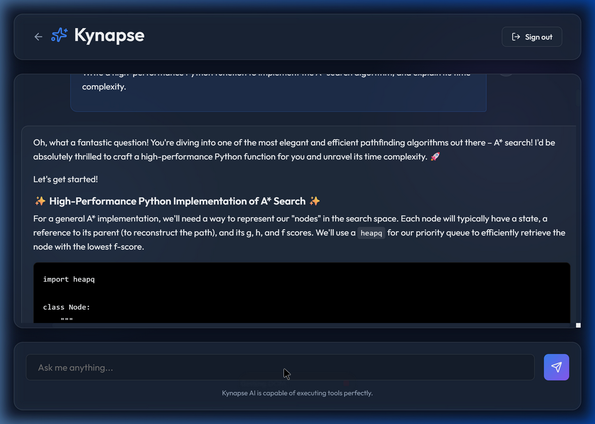

# Kynapse - Intelligent AI Chatbot

Kynapse is a modern, full-stack AI chatbot platform built for performance, beautifully fluid user experiences, and high-capability AI reasoning. Operating on a robust 3-layer architecture, Kynapse pairs a highly interactive, animated frontend with a deterministic, tool-executing backend.



## Architecture Overview

**1. Directive Layer**
Standard Operating Procedures (SOPs) defined in markdown (`directives/`). These plain-language instructions govern the AI's persona, constraints, and operational goals.

**2. Orchestration Layer (The AI Engine)**
Powered by state-of-the-art LLMs, the orchestration layer acts as the routing intelligence. It parses directives and determines when to rely on its internal knowledge versus invoking deterministic local tools.

**3. Execution Layer**
Deterministic Python scripts (`execution/`) designed for absolute reliability. When math, API calls, or scraping is required, the Orchestrator offloads the work to these rigid, tested scripts rather than hallucinating answers.

## Features

- **Fluid UI/UX:** Built with React, Vite, and Framer Motion. Features a dynamic glassmorphism interface, animated gradients, and interactive components.
- **Secure Authentication:** Fully integrated with Supabase. Native support for Email/Password, Google OAuth, and GitHub OAuth seamlessly.
- **Tool-Calling Backend:** A FastAPI Python server capable of autonomously invoking local calculator scripts and external APIs using LLM function calling.
- **Persisted Context:** Maintains session state and gracefully formats markdown and code blocks.

## Getting Started

### Prerequisites
- Node.js (v18+)
- Python (3.12+)
- A [Supabase](https://supabase.com/) Project

### Backend Setup

1. Navigate to the root folder:
   ```bash
   cd kynapse-chatbot
   ```
2. Install dependencies:
   ```bash
   pip install -r requirements.txt
   ```
3. Set up the `.env` file in the root with your AI API keys:
   ```
   GEMINI_API_KEY=your_api_key_here
   ```
4. Start the FastAPI server:
   ```bash
   python api/index.py
   ```
   *The backend will run on `http://localhost:8000`.*

### Frontend Setup

1. Navigate to the frontend directory:
   ```bash
   cd frontend
   ```
2. Install Node dependencies:
   ```bash
   npm install
   ```
3. Create a `.env` file in the `frontend` directory for Supabase configuration:
   ```
   VITE_SUPABASE_URL=your_supabase_project_url
   VITE_SUPABASE_ANON_KEY=your_supabase_anon_key
   ```
4. Start the Vite development server:
   ```bash
   npm run dev
   ```
   *The frontend will run on `http://localhost:5173`.*
