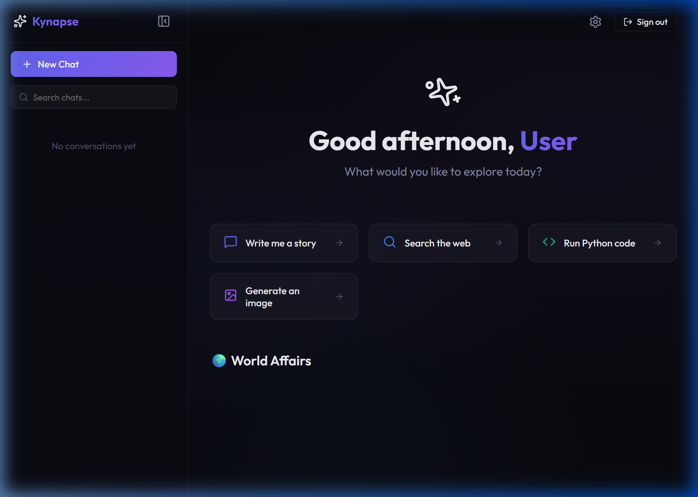
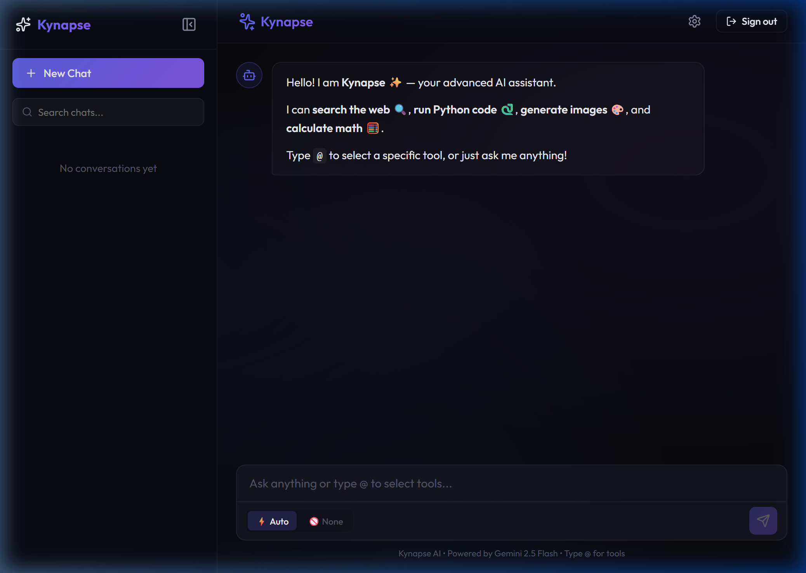
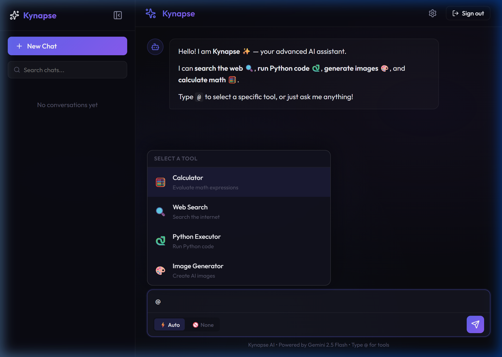

# 🌌 Kynapse: Advanced AI Assistant

**Intelligence, Redefined.** A professional, feature-rich AI chatbot platform built with React, FastAPI, and the Gemini 2.0 Flash model. Kynapse goes beyond basic chat with a suite of advanced tools, live world news, and a premium glassmorphism design.

[](https://reactjs.org/)
[](https://fastapi.tiangolo.com/)
[](https://deepmind.google/technologies/gemini/)

---

## ✨ Key Features

### 🕒 Intelligent Dashboard
A personalized command center featuring:
- **Dynamic Greetings**: Adapts based on the time of day.
- **Quick-Start Prompts**: One-click access to common tasks like story writing, web search, or image generation.
- **Recent Chat History**: Quickly resume your most recent conversations.
- **World Affairs News**: A live, high-fidelity news feed powered by GNews.



### 💬 Advanced Chat Experience
A distraction-free, high-performance chat interface:
- **🛠️ Tool mention system (@)**: Simply type `@` to explicitly invoke specific tools.
- **⚡ Tool Choice Modes**: Switch between **Auto** (AI decides when to use tools) and **None** (strict conversational mode).
- **📦 Inline Tool Execution**: Clear, collapsible blocks showing tool arguments, live results, and execution timing.
- **📊 Data Visualization**: Integrated Recharts support to automatically render interactive Bar, Line, and Pie charts from AI data.




### 🧰 The Powerhouse Toolset
1.  **Web Search**: Real-time browsing using DuckDuckGo to provide current information and citations.
2.  **Python Executor**: A sandboxed environment to run and test Python code on the fly.
3.  **Image Generator**: Create stunning visuals directly in the chat via Pollinations.ai.
4.  **Calculator**: High-precision mathematical operations for complex queries.

---

## 🛠️ Tech Stack

### Frontend
- **Framework**: React 18 with TypeScript & Vite
- **Styling**: Vanilla CSS (Premium Glassmorphism Design System)
- **Animations**: Framer Motion
- **Charts**: Recharts
- **Icons**: Lucide React

### Backend
- **Framework**: FastAPI (Python 3.10+)
- **LLM**: Google Gemini 2.1 Flash (via Vertex AI / GenAI SDK)
- **Search**: DuckDuckGo (DDGS)
- **News API**: GNews.io

---

## 🚀 Getting Started

### Prerequisites
- Python 3.10 or higher
- Node.js 18 or higher
- A Gemini API Key
- A GNews.io API Key

### Backend Setup
1. Navigate to the `Kynapse` directory:
   ```bash
   cd Kynapse
   ```
2. Install dependencies:
   ```bash
   pip install -r api/requirements.txt
   ```
3. Create an `.env` file in the `api` folder:
   ```env
   GEMINI_API_KEY=your_gemini_key_here
   GNEWS_API_KEY=your_gnews_key_here
   ```
4. Start the server:
   ```bash
   python -m uvicorn api.index:app --port 8000
   ```

### Frontend Setup
1. Navigate to the `frontend` directory:
   ```bash
   cd frontend
   ```
2. Install dependencies:
   ```bash
   npm install
   ```
3. Start the development server:
   ```bash
   npm run dev
   ```

---

## 📂 Project Structure

```text
├── docs/               # Documentation assets
│   └── screenshots/    # UI screenshots for README
├── Kynapse/            # Backend (FastAPI)
│   ├── api/
│   │   ├── execution/  # Tool implementation (Search, Python, etc.)
│   │   ├── index.py    # Main API entrypoint
│   │   └── ...
├── frontend/           # Frontend (React + Vite)
│   ├── src/
│   │   ├── components/ # Reusable UI pieces
│   │   ├── pages/      # Route-level pages (Dashboard, Chat, Settings)
│   │   └── ...
└── README.md           # You are here!
```

---

## 🛡️ License
Distributed under the MIT License. See `LICENSE` for more information.

---

<p align="center">
  Built with ❤️ for the AI community.
</p>
